# 博客配图设计方案

本文档包含所有博客配图的设计代码和方案，可以直接使用或导出为图片。

---

## 1. 架构图

### Mermaid 代码（可在 GitHub、Notion 等平台直接渲染）

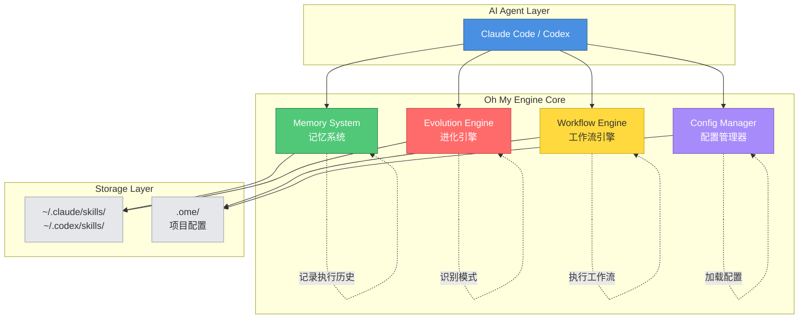

### 详细架构图

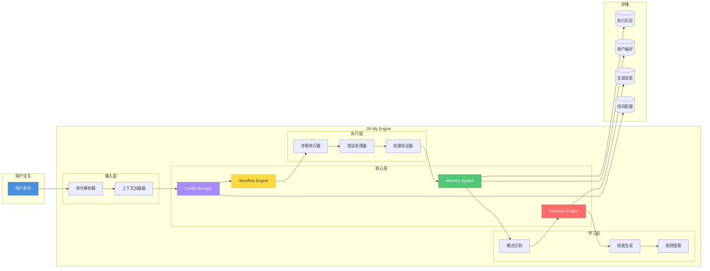

---

## 2. 效果对比图

### 开发效率提升对比

```mermaid
gantt
    title 任务完成时间对比
    dateFormat X
    axisFormat %H:%M
    
    section UI 还原
    传统方式 :a1, 0, 180m
    Oh My Engine :a2, 0, 30m
    
    section Bug 修复
    传统方式 :b1, 0, 60m
    Oh My Engine :b2, 0, 10m
    
    section 组件生成
    传统方式 :c1, 0, 40m
    Oh My Engine :c2, 0, 5m
    
    section API 集成
    传统方式 :d1, 0, 120m
    Oh My Engine :d2, 0, 20m
```

### 效率提升数据可视化（Mermaid）

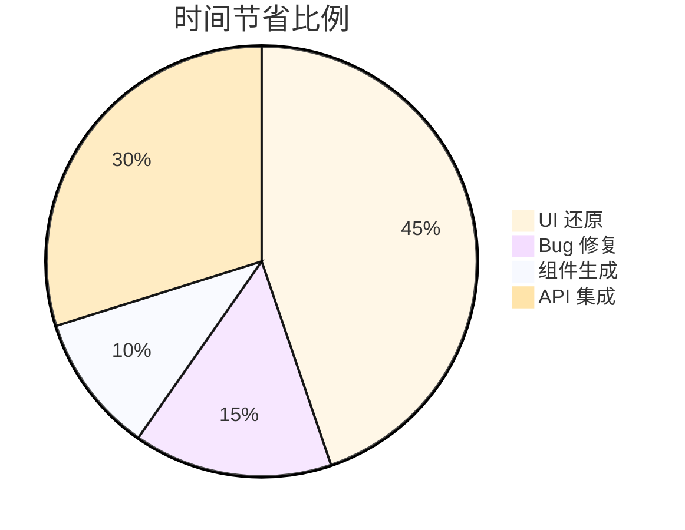

---

## 3. 工作流程图

### UI 还原工作流

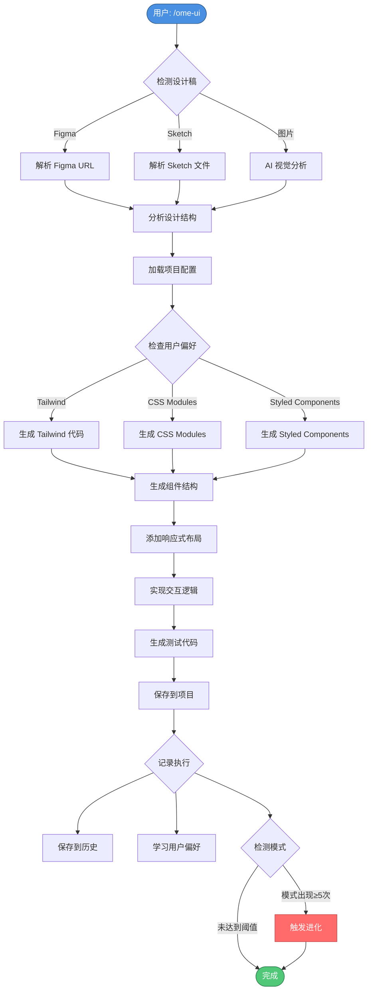

### Bug 修复工作流

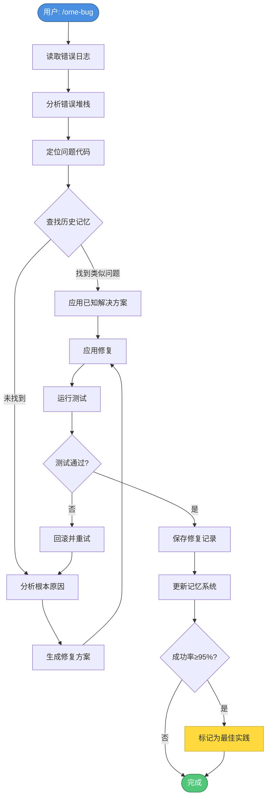

---

## 4. 进化机制图

### 自我进化流程

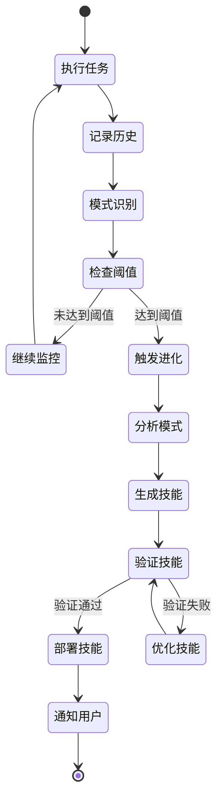

### 模式识别算法

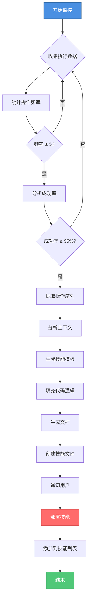

---

## 5. 学习曲线对比图

### ASCII 图表（适合终端展示）

```
传统 AI 助手 vs Oh My Engine 效率对比

效率
 100% ┤                    ╭────────────────
      │                 ╭──╯  Oh My Engine
  80% ┤              ╭──╯     (持续进化)
      │           ╭──╯
  60% ┤        ╭──╯
      │     ╭──╯  ╭──────────────────────
  40% ┤  ╭──╯  ╭──╯  传统 AI 助手
      │╭─╯  ╭──╯     (平稳但有上限)
  20% ┼╯ ╭──╯
      │╭─╯
   0% ┼╯
      └─┬────┬────┬────┬────┬────┬────┬──► 时间
        0    1    2    3    4    5    6   (周)
```

### Mermaid 时间线

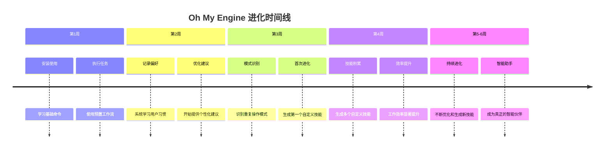

---

## 6. 数据可视化图表

### 效率提升数据（表格形式）

```
┌─────────────┬──────────┬──────────────┬────────┐
│   任务类型   │ 传统方式  │ Oh My Engine │  提升  │
├─────────────┼──────────┼──────────────┼────────┤
│  UI 还原    │ 2-3 小时 │   15-30 分钟  │  6x ⚡ │
│  Bug 修复   │ 30-60分钟│    5-10 分钟  │  6x ⚡ │
│  组件生成   │ 20-40分钟│     3-5 分钟  │  8x ⚡ │
│  API 集成   │ 1-2 小时 │   10-20 分钟  │  6x ⚡ │
└─────────────┴──────────┴──────────────┴────────┘

平均效率提升: 6.5x
时间节省率: 85%
```

### 进化统计数据

```
┌────────────────┬──────┬────────┬──────────┐
│  检测到的模式   │ 次数 │ 成功率 │ 生成技能  │
├────────────────┼──────┼────────┼──────────┤
│ API 超时重试   │  5   │  100%  │ ✓ 已生成 │
│ 表单验证       │  8   │   97%  │ ✓ 已生成 │
│ 图片优化       │  6   │  100%  │ ✓ 已生成 │
│ 错误边界       │  4   │  100%  │ ⏳ 待生成 │
│ 路由守卫       │  3   │   95%  │ ⏳ 监控中 │
└────────────────┴──────┴────────┴──────────┘

总计生成技能: 3 个
监控中模式: 2 个
```

---

## 7. 使用场景对比图

### 场景 1: UI 还原

```
传统方式:
┌─────────────────────────────────────────────────┐
│ 👤 用户: "帮我实现这个登录页面"                    │
│ 🤖 AI: "好的，我来实现..."                        │
│    [30分钟后]                                    │
│ 👤 用户: "样式不对，用 Tailwind"                  │
│ 🤖 AI: "好的，我来修改..."                        │
│    [15分钟后]                                    │
│ 👤 用户: "响应式也要做"                           │
│ 🤖 AI: "好的..."                                 │
│    [20分钟后]                                    │
│ ✅ 完成 (总耗时: ~65分钟)                         │
└─────────────────────────────────────────────────┘

Oh My Engine:
┌─────────────────────────────────────────────────┐
│ 👤 用户: /ome-ui                        │
│ 🧠 Engine: "检测到 Figma 链接，开始还原..."       │
│    ✓ 分析设计稿结构                              │
│    ✓ 生成组件代码（使用 Tailwind）               │
│    ✓ 实现响应式布局                              │
│    ✓ 添加交互逻辑                                │
│    ✓ 生成测试代码                                │
│ ✅ 完成！已生成 LoginPage.tsx (总耗时: ~5分钟)   │
└─────────────────────────────────────────────────┘

效率提升: 13x ⚡⚡⚡
```

### 场景 2: Bug 修复

```
传统方式:
┌─────────────────────────────────────────────────┐
│ 👤 用户: "API 调用报错了"                         │
│ 🤖 AI: "让我看看代码..."                         │
│    [读取代码]                                    │
│ 👤 用户: "检查网络请求"                           │
│ 🤖 AI: "好的..."                                 │
│    [检查网络]                                    │
│ 👤 用户: "看看日志"                              │
│ 🤖 AI: "好的..."                                 │
│    [分析日志]                                    │
│ 👤 用户: "试试添加重试逻辑"                       │
│ 🤖 AI: "好的，我来添加..."                       │
│ ✅ 完成 (总耗时: ~45分钟)                         │
└─────────────────────────────────────────────────┘

Oh My Engine:
┌─────────────────────────────────────────────────┐
│ 👤 用户: /ome-bug                       │
│ 🧠 Engine: "开始分析 Bug..."                     │
│    ✓ 读取错误日志                                │
│    ✓ 检查相关代码                                │
│    ✓ 分析网络请求                                │
│    ✓ 查找类似历史问题                            │
│    💡 发现：API 超时，已有解决方案               │
│    ✓ 应用重试逻辑（从记忆中）                    │
│    ✓ 测试通过                                    │
│ ✅ 完成！(总耗时: ~3分钟)                         │
└─────────────────────────────────────────────────┘

效率提升: 15x ⚡⚡⚡
```

---

## 8. 记忆系统可视化

### 记忆结构图

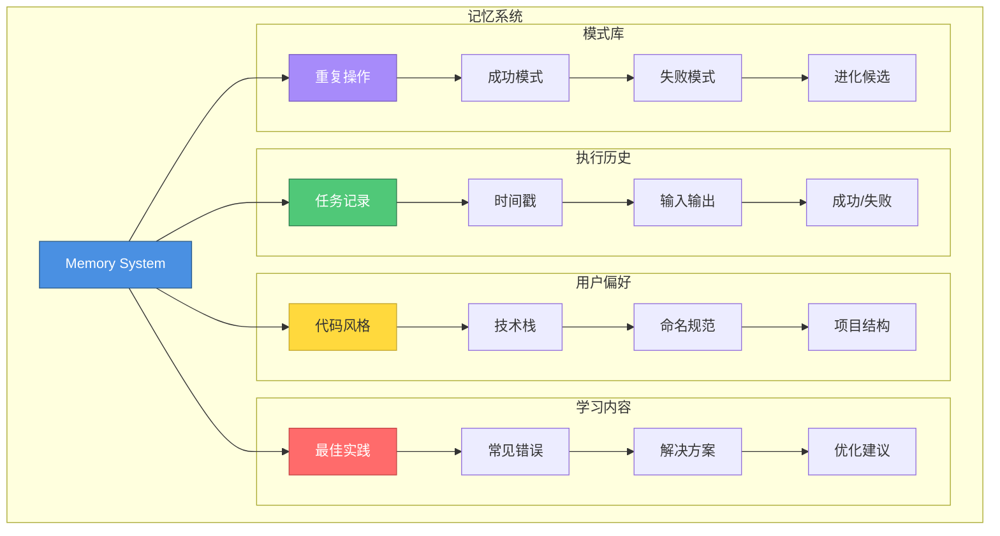

---

## 9. 项目配置结构图

```
.ome/
├── 📄 config.json              # 项目配置
│   ├── project                 # 项目信息
│   ├── preferences             # 用户偏好
│   ├── rules                   # 项目规则
│   └── workflows               # 工作流配置
│
├── 📁 workflows/               # 自定义工作流
│   ├── ui-restoration.yaml
│   ├── bug-analysis.yaml
│   └── custom-workflow.yaml
│
├── 📁 rules/                   # 项目规则
│   ├── coding-standards.md
│   ├── api-conventions.md
│   └── component-patterns.md
│
├── 📁 memory/                  # 执行记忆
│   ├── executions/            # 执行历史
│   ├── learnings/             # 学习内容
│   └── patterns/              # 识别的模式
│
└── 📁 templates/               # 代码模板
    ├── component.tsx
    ├── api-client.ts
    └── test.spec.ts
```

---

## 10. 技能生成流程图

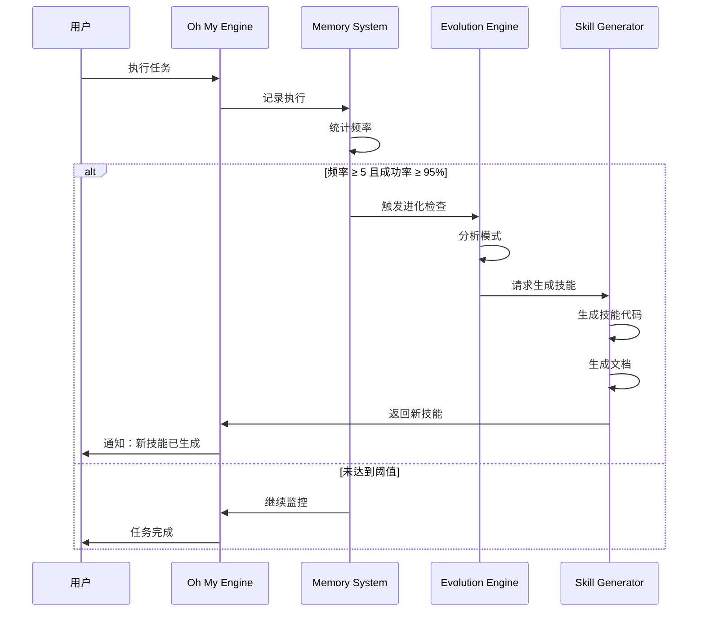

---

## 11. 对比图表（适合社交媒体）

### 简化版对比

```
传统 AI 助手          Oh My Engine
     ❌                    ✅
  无记忆能力    →    记住所有执行历史
  重复相同错误  →    学习并避免错误
  需要反复指导  →    自动应用偏好
  固定功能      →    自我进化生成新技能
  通用方案      →    项目定制化配置
```

### 功能对比矩阵

```
┌──────────────┬──────────┬──────────────┐
│   功能特性    │ 传统助手 │ Oh My Engine │
├──────────────┼──────────┼──────────────┤
│ 记忆能力     │    ❌    │      ✅      │
│ 学习能力     │    ❌    │      ✅      │
│ 自我进化     │    ❌    │      ✅      │
│ 项目配置     │    ❌    │      ✅      │
│ 工作流自动化 │    ❌    │      ✅      │
│ 模式识别     │    ❌    │      ✅      │
│ 技能生成     │    ❌    │      ✅      │
│ 历史追溯     │    ❌    │      ✅      │
└──────────────┴──────────┴──────────────┘
```

---

## 12. Logo 和 Banner 设计建议

### ASCII Logo

```
   ____  _       __  __         _____             _            
  / __ \| |     |  \/  |       |  ___|           (_)           
 | |  | | |__   | \  / |_   _  | |__ _ __   __ _ _ _ __   ___ 
 | |  | | '_ \  | |\/| | | | | |  __| '_ \ / _` | | '_ \ / _ \
 | |__| | | | | | |  | | |_| | | |__| | | | (_| | | | | |  __/
  \____/|_| |_| |_|  |_|\__, | \____/_| |_|\__, |_|_| |_|\___|
                         __/ |              __/ |              
                        |___/              |___/               

    🧠 Self-Evolving Workflow Framework
```

### Banner 设计元素

```
╔═══════════════════════════════════════════════════════════╗
║                                                           ║
║   🧠 Oh My Engine                                         ║
║                                                           ║
║   Self-Evolving Workflow Framework                        ║
║   for Claude Code & Codex                                 ║
║                                                           ║
║   ✨ Learns  •  💾 Remembers  •  🔄 Evolves               ║
║                                                           ║
║   ⚡ 6x Faster  •  🎯 Smarter  •  🚀 Better               ║
║                                                           ║
╚═══════════════════════════════════════════════════════════╝
```

---

## 13. 使用说明

### 如何使用这些图表

1. **Mermaid 图表**
   - 可以直接在 GitHub README 中使用
   - 在 Notion、Obsidian 等工具中渲染
   - 使用 https://mermaid.live 在线编辑和导出为 PNG/SVG

2. **ASCII 图表**
   - 适合在终端、代码块中展示
   - 可以直接复制到 Markdown 文档
   - 保持等宽字体以确保对齐

3. **导出为图片**
   - 使用 Mermaid CLI: `mmdc -i input.mmd -o output.png`
   - 使用在线工具: https://mermaid.live
   - 使用截图工具截取渲染后的图表

4. **自定义样式**
   - 修改 Mermaid 主题: `%%{init: {'theme':'dark'}}%%`
   - 调整颜色: 修改 `style` 定义
   - 调整大小: 导出时设置分辨率

---

## 14. 推荐的图片尺寸

### 社交媒体
- **Twitter/X**: 1200x675px (16:9)
- **LinkedIn**: 1200x627px
- **微信公众号**: 900x500px
- **知乎**: 1200x675px

### 博客平台
- **掘金**: 1920x1080px
- **Medium**: 1400x700px
- **Dev.to**: 1000x420px

### GitHub
- **Social Preview**: 1280x640px
- **README Banner**: 1200x300px

---

## 15. 配色方案

```
主色调:
- 蓝色 (Claude): #4A90E2
- 绿色 (成功): #50C878
- 红色 (进化): #FF6B6B
- 黄色 (工作流): #FFD93D
- 紫色 (配置): #A78BFA

辅助色:
- 深蓝: #2E5C8A
- 深绿: #2E7D4E
- 深红: #C44545
- 深黄: #C4A72E
- 深紫: #7C5CBF

中性色:
- 灰色: #E5E7EB
- 深灰: #9CA3AF
- 黑色: #1F2937
- 白色: #FFFFFF
```

---

## 使用建议

1. **博客文章**: 使用图 1、3、5、7
2. **GitHub README**: 使用图 1、2、9
3. **社交媒体**: 使用图 5、11、12
4. **技术文档**: 使用图 1、4、8、10
5. **演示文稿**: 使用所有图表

所有图表都可以根据需要自定义和调整！
