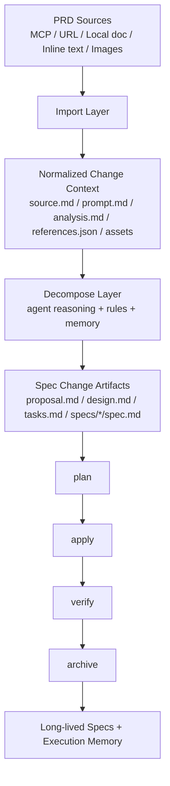

# Prompt-Driven Spec Intake Architecture

## Goal

Oh My Engine should support the real workflow teams actually use:

`PRD + operator prompt -> decomposition -> proposal/design/tasks/spec delta -> apply/verify/archive`

The current OpenSpec-compatible workflow already handles the back half of that lifecycle well. What is missing is a thin intake layer that can ingest multi-source PRD inputs, normalize them, and hand structured context to the existing spec lifecycle.

This document defines the recommended final architecture.

## Design Decision

Use a hybrid model:

- Keep `openspec/` as the source of truth for durable specs and active changes
- Use agent-native reasoning for PRD understanding, prompt interpretation, image reading, and MCP retrieval
- Add a small, explicit intake layer that turns those inputs into persistent change context artifacts

This keeps the spec core stable while still supporting prompt-driven and multimodal inputs.

## Why This Shape

### Pure agent-native intake is not enough

- Results are hard to trace back to the source PRD, prompt, or images
- Reviewers cannot easily audit how tasks and requirements were derived
- The memory system cannot reliably learn from unstructured executions

### Pure spec-native intake is too heavy

- The spec core would absorb source-specific adapters, image handling, and tool-specific logic
- Every new MCP or document source would bloat the main workflow
- Claude Code and Codex differences would leak into the spec runtime

### Recommended split

- Agent: perception, retrieval, synthesis, ambiguity detection
- Spec: persistence, traceability, lifecycle, verification, archive

## Final Architecture



## Layer Responsibilities

### 1. Source Layer

Input sources may include:

- MCP-fetched PRDs from external systems
- Local markdown or text documents
- URLs or copied document content
- Inline operator prompts
- Images embedded in the PRD or attached separately

This layer is intentionally unstable and source-specific.

### 2. Intake Layer

The intake layer creates durable, reviewable artifacts under the active change.

It must:

- record where the PRD came from
- store the exact prompt used for decomposition
- store image or attachment references
- persist extracted observations
- preserve unresolved questions before implementation starts

It must not:

- own long-lived capability spec logic
- replace the existing `plan/apply/verify/archive` flow
- become a general-purpose integration framework inside the spec core

### 3. Decompose Layer

The decompose layer uses:

- normalized intake artifacts
- project rules
- project memory
- existing long-lived capability specs

Its job is to translate source inputs into standard OpenSpec change artifacts.

This is where prompt-driven decomposition belongs.

### 4. Spec Lifecycle Layer

Once change artifacts exist, the current spec lifecycle remains the system of record:

- `plan`
- `apply`
- `verify`
- `archive`

This layer should continue to reason about structured text artifacts, not raw images or raw MCP payloads.

## Change Directory Layout

Recommended active change layout:

```text
.ome/spec/
└── changes/
    └── <change-id>/
        ├── context/
        │   ├── source.md
        │   ├── prompt.md
        │   ├── analysis.md
        │   ├── references.json
        │   └── assets/
        │       ├── prd-001.png
        │       └── flowchart-01.jpg
        ├── proposal.md
        ├── design.md
        ├── tasks.md
        └── specs/
            └── <capability>/
                └── spec.md
```

## Context Artifact Contract

### `source.md`

Human-readable normalized source document.

Suggested sections:

- source type
- source identifiers
- import timestamp
- imported text
- source notes

### `prompt.md`

The operator prompt that guided decomposition.

Suggested sections:

- decomposition goal
- emphasis and constraints
- exclusions
- output expectations

### `analysis.md`

Agent-produced working notes that convert source material into implementation-ready findings.

Suggested sections:

- key requirements
- inferred constraints
- image observations
- ambiguities
- open questions
- recommended capability split

### `references.json`

Machine-readable provenance and traceability.

Suggested fields:

- `changeId`
- `sources[]`
- `attachments[]`
- `promptHash`
- `importedAt`
- `analysisStatus`
- `openQuestions[]`

### `assets/`

Stable local copies of referenced images or attachments when available.

The system should treat these as evidence inputs, not as downstream verification targets.

## Command Model

Recommended command surface:

```text
ome spec init
ome spec import <change-id>
ome spec decompose <change-id>
ome spec plan <change-id>
ome spec apply <change-id>
ome spec verify <change-id>
ome spec archive <change-id>
```

### `import`

Purpose:

- ingest PRD content from supported sources
- copy attachments into change-local storage
- persist normalized source and reference metadata

Outputs:

- `context/source.md`
- `context/prompt.md` when prompt input is provided
- `context/references.json`
- `context/assets/`

### `decompose`

Purpose:

- read the normalized context
- extract requirements, constraints, and risks
- translate prompt intent into structured change artifacts

Outputs:

- `context/analysis.md`
- `proposal.md`
- `design.md`
- `tasks.md`
- `specs/*/spec.md`

## Multimodal Handling

PRDs with images should be handled through a text-normalization rule:

1. Save the image in `context/assets/`
2. Let the agent inspect the image
3. Write image-derived facts into `context/analysis.md`
4. Convert those facts into textual acceptance criteria, design constraints, or tasks
5. Run downstream verification against text artifacts, not raw images

This avoids making `verify` depend on vision inference.

## MCP Strategy

MCP should live at the intake boundary, not inside the long-lived spec core.

Recommended pattern:

- source-specific adapter fetches content
- adapter output is normalized into `source.md` and `references.json`
- the rest of the pipeline consumes only normalized change context

That keeps the change lifecycle portable across Claude Code, Codex, and future agents.

## Verification Contract

Verification should continue to prove:

- tasks are complete
- acceptance criteria are checked
- spec deltas are concrete and valid
- project verification commands pass

Verification should not need to:

- call the original MCP again
- reopen source images
- reconstruct the original PRD interpretation

Those concerns belong in intake artifacts and provenance, not in the final quality gate.

## Ownership Boundaries

| Concern | Owner |
| --- | --- |
| PRD fetching | intake adapter |
| Image inspection | agent during import/decompose |
| Prompt interpretation | decompose |
| Provenance storage | intake artifacts |
| Long-lived capability spec updates | archive |
| Project memory updates | existing memory system |
| Final implementation verification | existing verify stage |

## Recommended MVP

Do not build a heavy platform first. Start with the smallest version that supports the real workflow.

Phase 1:

- add `context/` artifact contract
- add `import`
- add `decompose`

Phase 2:

- add local file and pasted markdown import
- persist prompt and provenance metadata
- support image attachment storage

Phase 3:

- add MCP adapters for common PRD sources
- add ambiguity capture and review guidance

Phase 4:

- connect intake artifacts into memory and evolution
- identify reusable prompt and decomposition patterns

## Bottom Line

The correct target architecture is not "OpenSpec only" and not "agent magic only".

The right model for Oh My Engine is:

- OpenSpec-style durable artifacts
- agent-native multimodal understanding
- a thin, explicit intake layer between them

That gives the system a stable spec core without losing the flexibility needed for real PRD-driven work.
